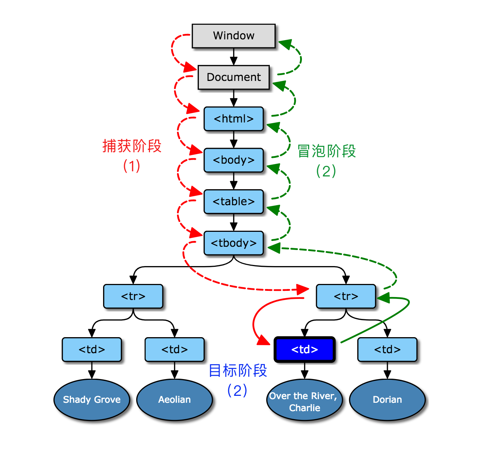

### Event 对象
Event 对象表示有关事件的信息。  
Event 对象的属性提供了有关事件的细节（例如，事件在其上发生的元素）。Event 对象的方法可以控制事件的传播。

##### 标准 Event 属性
| 属性 | 描述 |
|-|-|
| bubbles |	返回布尔值，指示事件是否是起泡事件类型。|
| cancelable |	返回布尔值，指示事件是否可拥可取消的默认动作。|
| currentTarget |	返回其事件监听器触发该事件的元素。|
| eventPhase |	返回事件传播的当前阶段。|
| target |	返回触发此事件的元素（事件的目标节点）。|
| timeStamp |	返回事件生成的日期和时间。|
| type |	返回当前 Event 对象表示的事件的名称。|

例子：
```javascript
//chrome点击事件对象
MouseEvent {
	altKey: false
	bubbles: true
	button: 0
	buttons: 0
	cancelBubble: false
	cancelable: true
	clientX: 237
	clientY: 558
	composed: true
	ctrlKey: false
	currentTarget: null
	defaultPrevented: false
	detail: 1
	eventPhase: 0
	fromElement: null
	isTrusted: true
	layerX: 237
	layerY: 32
	metaKey: false
	movementX: 0
	movementY: 0
	offsetX: 77
	offsetY: 33
	pageX: 237
	pageY: 558
	path:
		(9)[div.contact - btn, div.btm - box, div.page, body, shadow, document - fragment, html, document, Window]
	relatedTarget: null
	returnValue: true
	screenX: 454
	screenY: 746
	shiftKey: false
	sourceCapabilities: InputDeviceCapabilities {
		firesTouchEvents: true
	}
	srcElement: div.contact - btn
	target: div.contact - btn
	timeStamp: 196913.30000001471
	toElement: div.contact - btn
	type: "click"
	view: Window {
		postMessage: ƒ,
		blur: ƒ,
		focus: ƒ,
		close: ƒ,
		frames: Window,
		…
	}
	which: 1
	x: 237
	y: 558
}
```

#### 标准 Event 方法
preventDefault() 通知浏览器不要执行与事件关联的默认动作。  
stopPropagation() 终止事件在传播过程的捕获、目标处理或起泡阶段进一步传播。调用该方法后，该节点上处理该事件的处理程序将被调用，事件不再被分派到其他节点。  

### Event对象哪来的
事件流所描述的就是从页面中接受事件的顺序。
#### DOM事件流
DOM事件流包括三个阶段:  
1.事件捕获阶段  
2.处于目标阶段  
3.事件冒泡阶段   
ps:事件冒泡即事件开始时，由最具体的元素接收（也就是事件发生所在的节点），然后逐级传播到较为不具体的节点。 

上图表明DOM处理事件流的三个阶段，而Event对象就是这个过程中产生的 <a href="https://www.w3.org/TR/DOM-Level-3-Events/#dom-event-architecture" target="_blank">了解详情</a>
